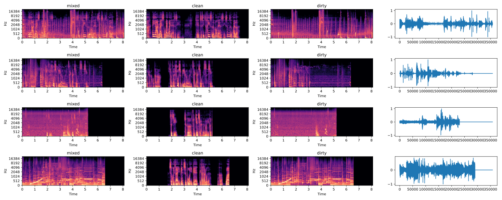

# Focused Speaker Extractor

A model that derives from TSE (Target Speaker Extraction) models, designed to **extract ONLY ONE speaker's speech from all kinds of noises**, including other people's voice, game SFX, noise, etc.

Serve as infrastructural model for downstream tasks, such as ASR, SVC, SVS, TTS, etc.

Unlike most TSE studies that runs at 8kHz, the model runs at 44.1kHz to ensure the output could be further utilized.

## How to use

**WARNING**: The project is still in it's early stages. All information provided here is for documentation purpose only and is subject to change without notice.

### Data preparation

You need clean data and dirty data to train this model. Here's an example file layout:

```
datasets
├── clean
│   └── spk0
│       └── bootstrap
│           ├── src_0_0.wav
│           ├── src_0_1.wav
│           ├── src_0_10.wav
│           ├── src_0_100.wav
│           ├── ...
│           └── src_5_99.wav
└── dirty
    ├── other
    │   └── stardew_valley
    │       ├── src_0.wav
    │       └── src_1.wav
    └── spk0
        └── stardew_valley
            ├── src_0.wav
            ├── src_1.wav
            └── src_2.wav
```

Here we use spk0's clean data (bootstrap) and other's stardew_valley noise to build an extractor specifically targeted to extract spk0's speech mixed with stardew valley music, sfx and ambient noise.

Make sure that all files in `clean/spk0` have length in 5-15s, otherwise you may get CUDA OOM. You can use `slicer.py` to slice some long, clean audio that contains only the target speaker's voice into segments that meets the length requirement. You can find more information about the slicer in the Appendix I section.

### Training

```bash
python train.py
```

Unfortunately we still doesn't support command line as we are still prototyping things. You must edit the `TrainArgs` object passed into the `train` function in `train.py`.

### Inference

```bash
python infer.py
```

If you want to infer a file, you need to manually edit the `infer.py` and remove the `glob.glob()` and manually specify the path to the file. You will also need to specify the checkpoint from training phase when initializing `InferArgs`.

## Data preparation

See `dataset.py` for implementation details.

Here's what happened inside of `MixedAudioDataset`:

- Load a clean wav $c$, then apply offset to shift it left or right, while keeping it's shape by zero padding on the left or right side.
- Randomly pick a segment with the same length as the clean wav, from random file in all provided dirty folders. We denote it as $d$.
- Calculate max $w$ such that $\forall i \in [0, \lvert c \rvert), c_i + w d_i \in [-1, 1]$.
- Return $c + w_{\max} d$.

Here's what `MixedAudioDataset` produced:



Other data augmentation schemes are under research.

## Structure

We use `DPTNet` as the speech extractor for now.

## Todo

- [ ] Apply [sigma-reparam](https://github.com/apple/ml-sigma-reparam.git) to the transformers
- [ ] Substitute transformer block with [RWKV](https://github.com/BlinkDL/RWKV-LM.git)
- [ ] Try frequency-domain solutions (e.g. diffusion-based approach)
- [ ] Separate model-specific args from training args and infer args
- And most importantly, read more papers...

## References & Acknowdgements

- [DPTNet](https://arxiv.org/pdf/2007.13975.pdf)
- [Forked DPTNet](https://github.com/ilyakava/DPTNet)

## Appendix I: Slicer

First, we compute the sliding RMS for given input wav $y$. Then, given a threshold, we get set of audio clips $\mathcal{C}$ such that $\forall c \in \mathcal{C}$, $\mathrm{rms}[l_c, r_c] > t$ where $\mathrm{rms}$ is the rms curve, $l_c$ and $r_c$ are left-right boundaries respectively.

Given $\mathcal{C}$ we could compute the complementary set of silence segments $\mathcal{S}$ such that:

$$
\begin{aligned}
\lvert \mathcal{S} \rvert &= n + 1 \\
l_{s_i} &= r_{c_{i - 1}} \\
r_{s_i} &= l_{c_{i}} \\
l_{s_0} &= 0 \\
r_{s_n} &= \lvert y\rvert
\end{aligned}
$$

The problem could now be converted to selecting some silence segments to split the input audio such that each split is 5-15s away from the last split. We use dynamic programming (or memorized search-order optimized searching) to solve this problem.

Let $\mathrm{dp}[i]$ be the maximum number of clips covered in set $\mathcal{C}_{:i-1} = \{c_0, \cdots, c_{i-1}\}$ when $s_i$ is chosen as the split point. The transition equation is:

$$
\mathrm{dp}[i] = \max\left(\max_{l_{s_i} - r_{s_j} \in [\textrm{lower}, \textrm{upper})} (\mathrm{dp}[j] + i - j), \max_{l_{s_i} - r_{s_j} \notin [\textrm{lower}, \textrm{upper})}(\mathrm{dp}[j])\right)
$$

See `slicer.py:calc_dp` for more implementation details, e.g. how to build equivalent but much faster conditions for each of the subexpressions in the outermost `max` function.

